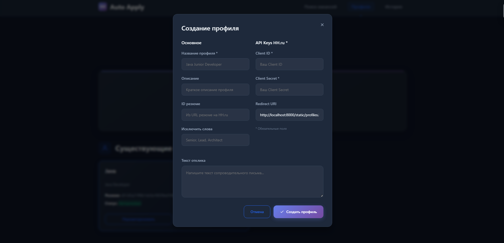
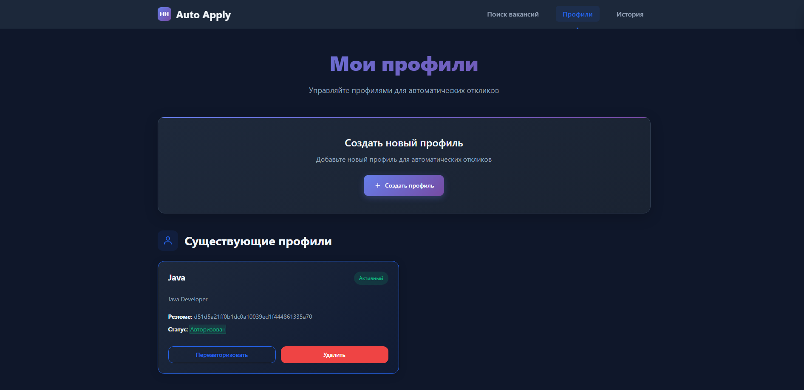
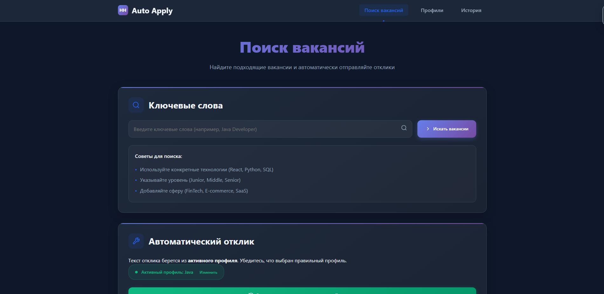

# HH Auto Apply

**HH Auto Apply** — это приложение, которое автоматически откликается на вакансии на платформе HeadHunter, используя данные, полученные через API HH.

## Установка

### Требования

- Обязательно наличие приложения на [https://dev.hh.ru/](https://dev.hh.ru/).
- Необходимо создать профиль в приложении для работы с функциями автоматических откликов.

### Старт работы

1. **Создание приложения на HeadHunter:**
   - Перейдите на [https://dev.hh.ru/](https://dev.hh.ru/).
   - Зарегистрируйте свое приложение.
   - После регистрации приложения получите **Client ID** и **Client Secret**, которые будут использованы для авторизации в приложении.

2. **Создание профиля:**
   - Введите необходимые данные для профиля, такие как имя, описание, резюме и другие параметры.
   - Для использования приложения необходимо активировать хотя бы один профиль.
   
   **Важно:** Активный профиль будет использоваться для автоматических откликов.

3. **Запуск приложения:**
   - После создания и активации профиля вы сможете использовать функциональность автоматического отклика на вакансии.

### Описание работы

- После регистрации профиля и получения токена авторизации можно выполнить поиск вакансий, просматривать их, а затем отправлять отклики.
- Приложение позволяет:
  - Автоматически отправлять отклики на вакансии.
  - Откликаться вручную через интерфейс приложения.
  - Просматривать историю откликов.

## Экран

Скрины экрана, которые показывают процесс работы приложения:

1. **Создание профиля** — добавление информации о профиле, настройка параметров.
2. **Поиск вакансий** — поиск вакансий по ключевым словам и географическому положению.
3. **История откликов** — отображение всех откликов с возможностью их фильтрации.

## Лицензия

MIT License
